# PIM architecture diagrams

Diagrams for the product set versioning feature, written in [Mermaid](https://mermaid.js.org) so GitHub
renders them. They mirror the code in [`pim-service/`](../pim-service); the rationale is in
[`product-set-versioning.md`](product-set-versioning.md).

| # | Diagram | Answers |
|---|---|---|
| 1 | [Component diagram](#1-component-diagram) | What are the building blocks and who may depend on whom? |
| 2 | [High-level flow chart](#2-high-level-flow-chart) | How does a seller's change reach customers? |
| 3 | [State machines](#3-state-machines) | What states can a version and a country assignment be in? |
| 4 | [Class diagrams](#4-class-diagrams) | What are the domain model, ports and adapters? |
| 5 | [Sequence diagrams](#5-sequence-diagrams) | What happens, step by step, in each use case? |
| 6 | [Database schema](#6-database-schema) | How is a version stored? |

---

## 1. Component diagram

Gradle modules and the systems around them. Solid arrows are calls and dotted arrows are "implements".
Everything points towards `domain`; adapters never depend on each other. `bootstrap` is the outer shell that
knows all modules: it creates the services, wraps each use case in a transaction, and plugs the adapters into the ports.

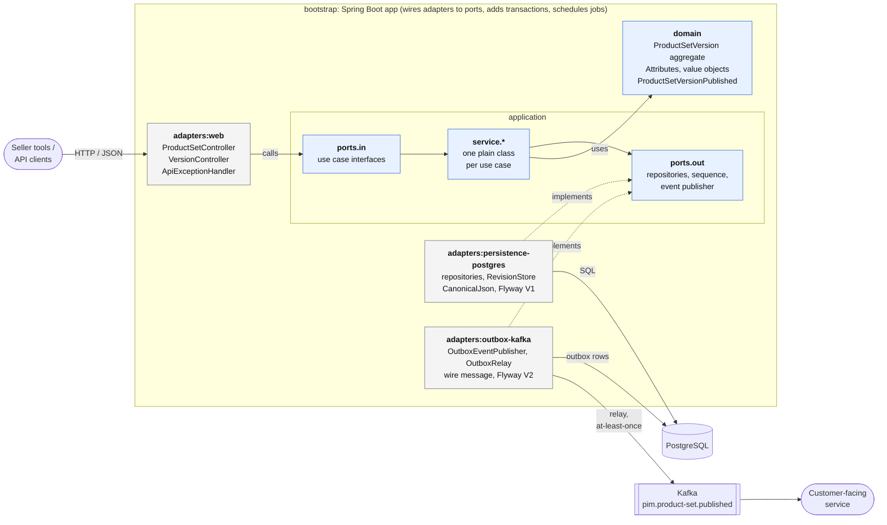

| Rule | Enforced by |
|---|---|
| `domain` has no dependencies | Gradle module has none; ArchUnit `domainIsPlainJava` |
| `application` has no framework | depends only on `domain`; ArchUnit `applicationIsFrameworkFree` |
| Adapters only depend on `application` | Gradle `implementation` scopes; ArchUnit `onionArchitecture` |

---

## 2. High-level flow chart

From a seller's edit to what a customer sees. The two rules that matter: **drafts are never sent
downstream**, and **each country is moved to an approved version explicitly**.

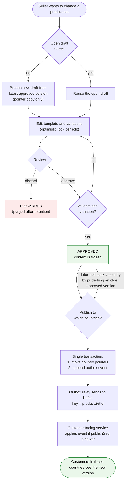

---

## 3. State machines

### 3.1 Version lifecycle

Only a `DRAFT` can change. `APPROVED` content is immutable (domain rule + database trigger).

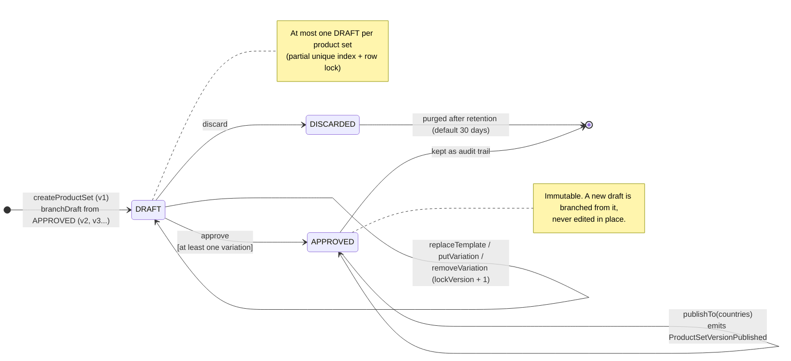

| Illegal action | Result |
|---|---|
| Edit, approve or discard a non-`DRAFT` | `IllegalVersionStateException` → HTTP 409 |
| Publish a non-`APPROVED` version | `IllegalVersionStateException` → HTTP 409 |
| Branch a draft from a non-`APPROVED` version | `IllegalVersionStateException` → HTTP 409 |
| Edit with an outdated `lockVersion` | `StaleVersionException` → HTTP 409 |

### 3.2 Country assignment

One row per (product set, country) in `country_version`. Publishing always moves a country to an
approved version, including an older one (rollback), and stamps a new, higher `publish_seq`.

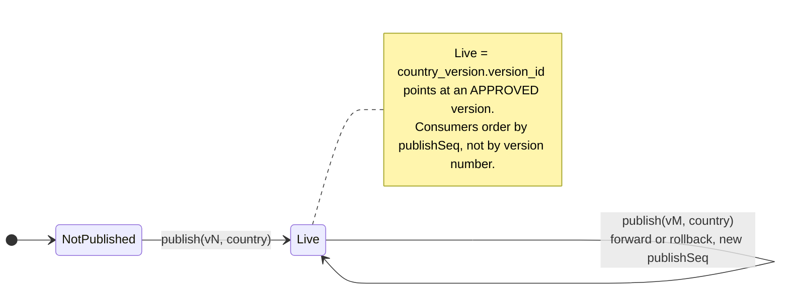

---

## 4. Class diagrams

### 4.1 Domain model

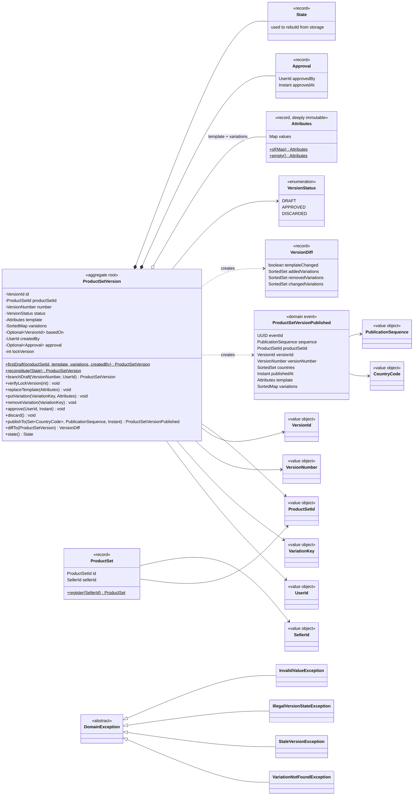

### 4.2 Application layer: ports and use cases

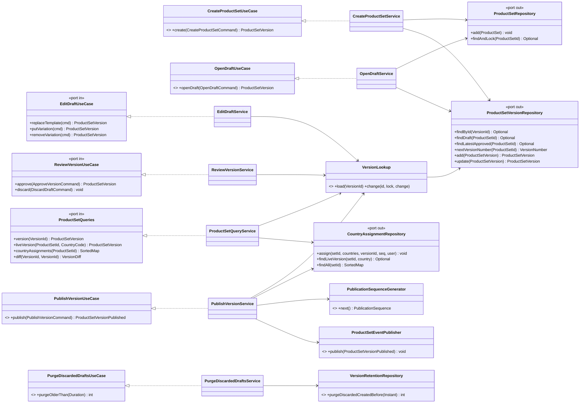

### 4.3 Adapters

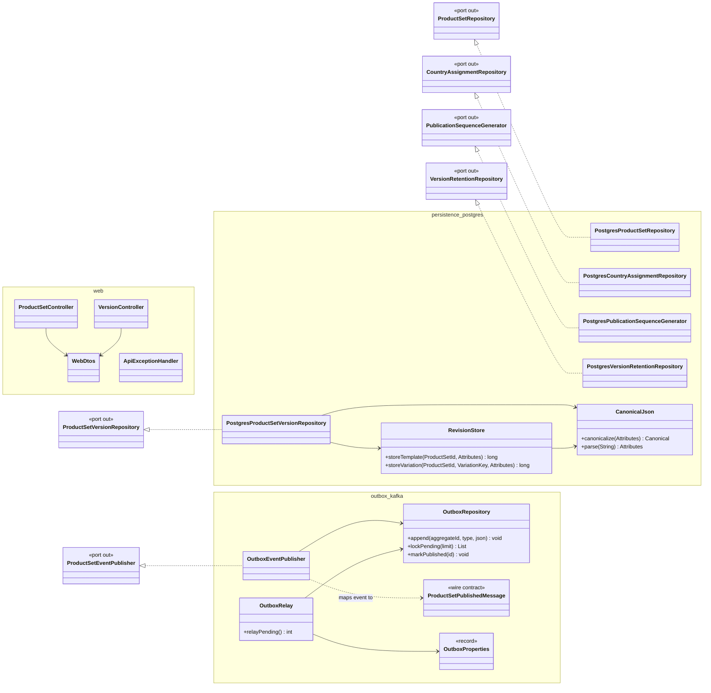

---

## 5. Sequence diagrams

In every diagram below, the `use case` participant is the plain service wrapped by `TransactionalUseCases`,
so each call is **one database transaction**.

### 5.1 Open a draft

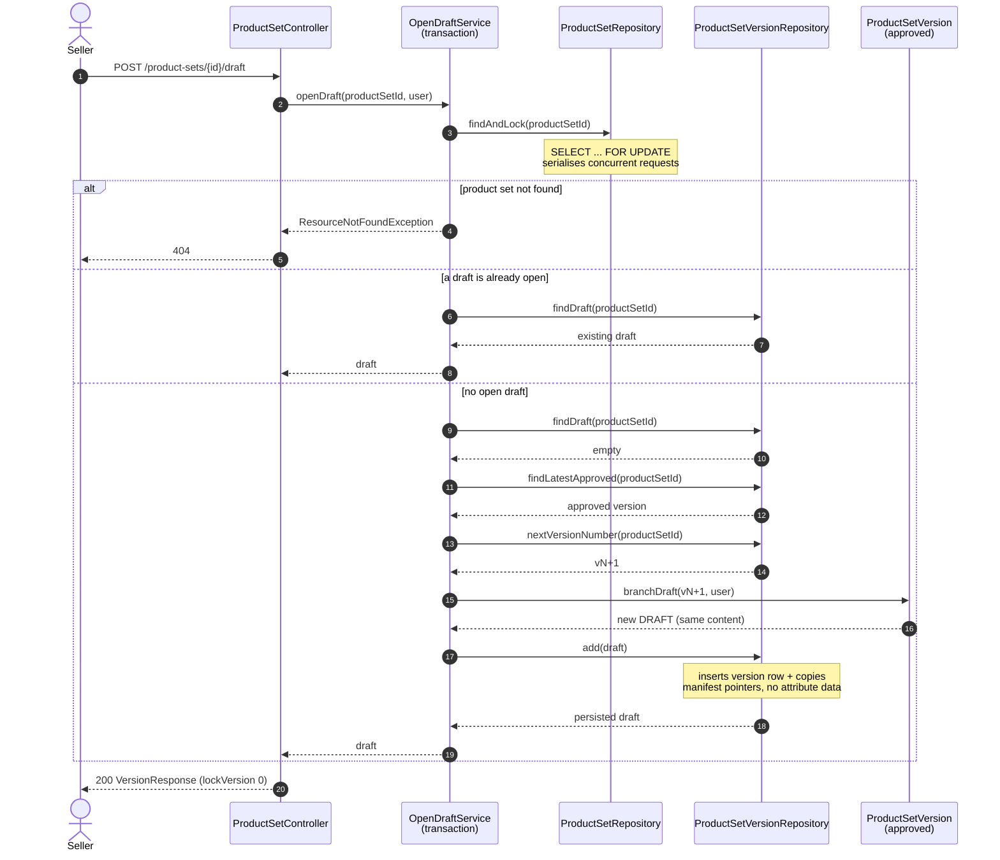

### 5.2 Edit a variation (optimistic lock + structural sharing)

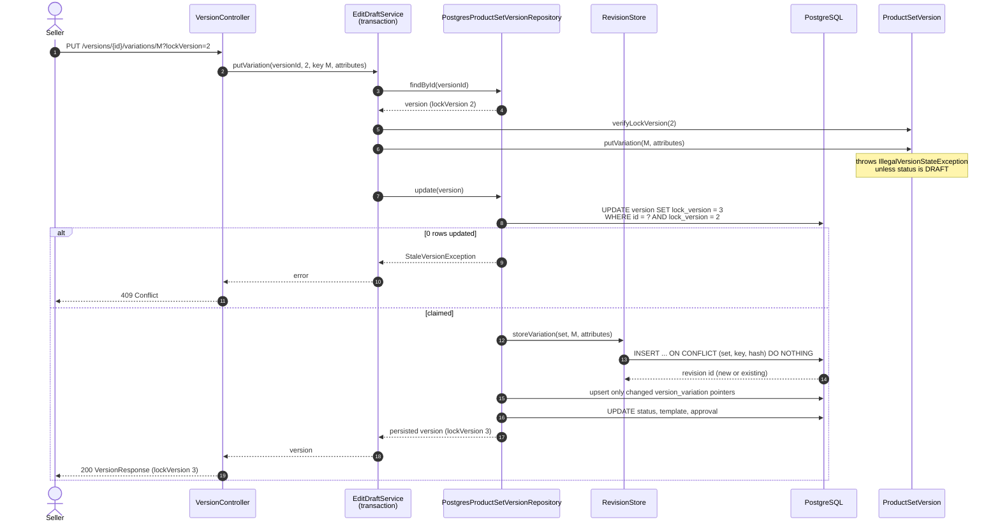

### 5.3 Approve and publish to countries

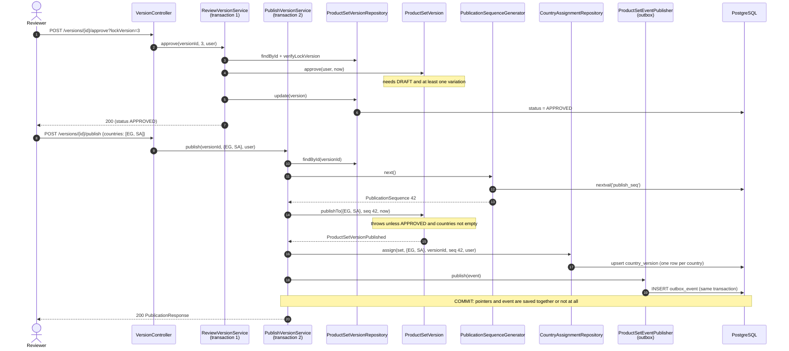

### 5.4 Outbox relay to the customer-facing service

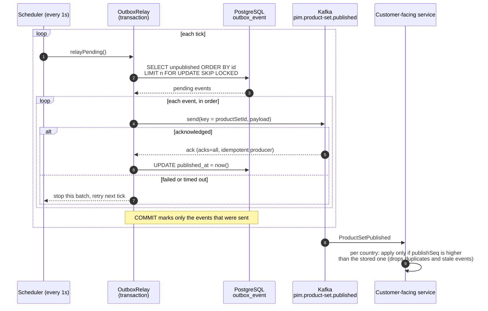

---

## 6. Database schema

Defined in `adapters/persistence-postgres/.../V1__product_set_versioning.sql` and
`adapters/outbox-kafka/.../V2__outbox.sql`.

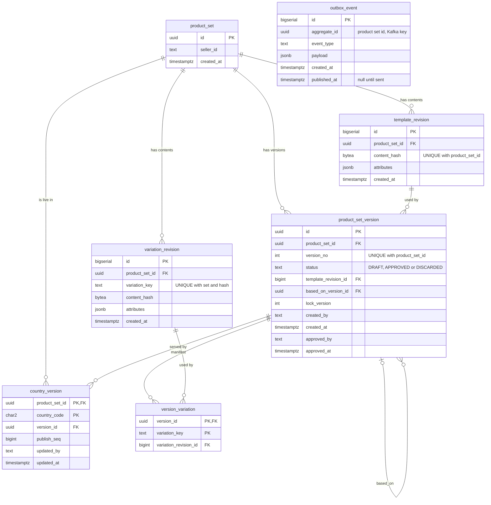

`outbox_event` has no foreign keys on purpose: it is a transport buffer, not part of the domain model.
The sequence `publish_seq` is global and strictly increasing.

### Constraints and indexes that carry business rules

| Object | Rule it enforces |
|---|---|
| `UNIQUE (product_set_id, content_hash)` on `template_revision` | identical template content is stored once |
| `UNIQUE (product_set_id, variation_key, content_hash)` on `variation_revision` | identical variation content is stored once |
| `UNIQUE (product_set_id, version_no)` | version numbers never repeat within a product set |
| partial unique index `product_set_version_one_draft` `WHERE status = 'DRAFT'` | at most one open draft per product set |
| partial index `product_set_version_latest_approved` `(product_set_id, version_no DESC) WHERE status = 'APPROVED'` | fast "latest approved version" lookup |
| `PRIMARY KEY (product_set_id, country_code)` on `country_version` | one live version per country, and a single-row lookup per country |
| `CHECK (status IN (...))`, `CHECK (version_no >= 1)` | valid lifecycle values |
| trigger `version_variation_immutable` | rejects any change to the manifest of a non-draft version |
| trigger `product_set_version_immutable` | rejects changing status, template or number of an `APPROVED` version |
| partial index `outbox_event_unpublished` `WHERE published_at IS NULL` | the relay's polling query stays cheap as history grows |
| index `version_variation_revision` | retention can find revisions that nothing points to |

### Why a version stores no attribute data

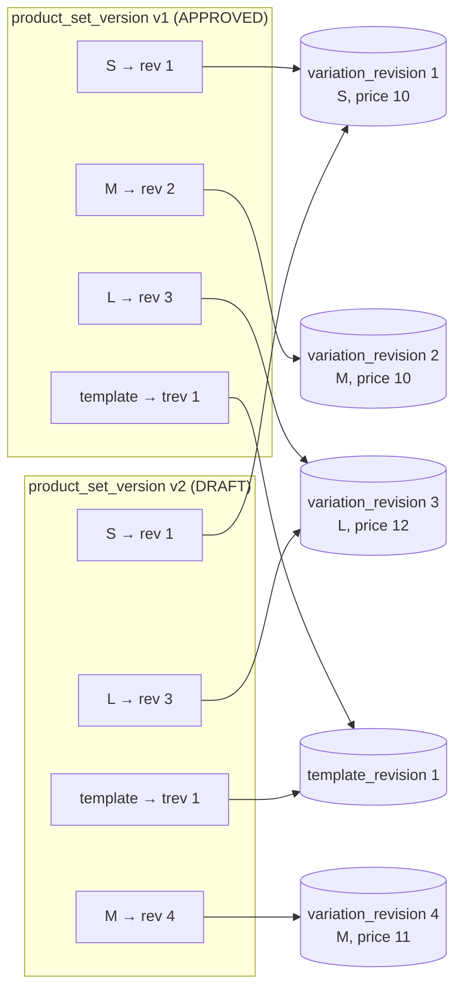

Changing M's price created one new `variation_revision` row (4). Everything else is shared by pointer.
